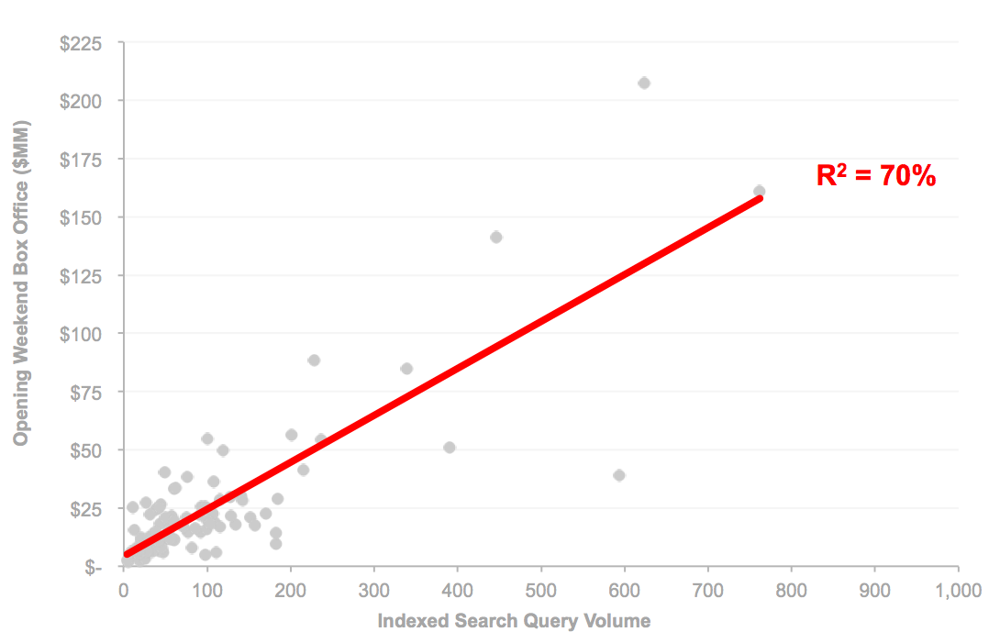
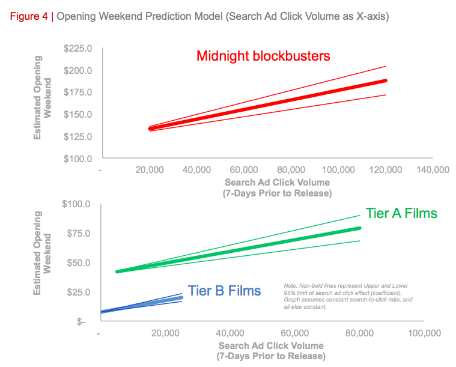

# [Google Quantify Movie Magic 解析](http://www.google.com/think/research-studies/quantifying-movie-magic.html)

## 結論
1. 2011 到 2012 在 Google 搜索電影放映相關關鍵字的次數同比已經增長 56%
2. 單純的搜索次數以及 AdWord 的點擊次數的模型可以解釋 92% 的實際票房變化以及 90% 之後的實際票房變化
3. 加上分析一個月前在 Youtube 的電影預告片搜索次數以及其他變因的模型可以解釋 94% 的實際票房變化
4. 電影預告片的搜索次數是重要關鍵
5. 48% 的人在觀看當天才購買電影票

## 研究內容
### 預測開演前一天的影片票房成績
#### 模型1: 票房與 indexed search query volumn 的簡單線性回歸分析

#### 結論
1. *R^2^ = 0.70*

#### 模型2: 考慮 Google 自己的[關鍵字搜索](http://www.google.com/adwords/)後

##### 結論
1. *R^2^ = 0.92*
2. 發現實際票房與關鍵字搜索有統計相關
	* 如果一個電影在首映前一天在 Google 關鍵字搜索獲得超過 *20,000* 次的點擊率，在週末上映的首輪票房有可能最高到達 750 萬美元的票房 

#### 考慮變因(超過三十個)
1. 影片類型
2. 季節
3. 明星影響力
4. 影片間的競爭
5. [MPAA (Motion Picture Association of America) 評分](http://www.mpaa.org/ratings)
6. 評論家與觀眾評分
7. 搜索數量
8. AdWord 點擊數量
9. 上映影院數量
10. 上映狀態

### 電影上映後的票房預測
雖然很多人認為首映票房的成績對整體票房有深遠的影響，但最近的二部電影 [Itentity Thief](http://zh.wikipedia.org/wiki/身份窃贼) 和 [Oz: The Great and Powerful](http://zh.wikipedia.org/wiki/魔境仙踪) 都是在上映第一週後才有[爆炸性的票房](http://collider.com/friday-box-office-oz-the-great-and-powerful-conjures-24-1-million-opening/)

！

> After weeks of disappointing returns, the domestic box office is receiving a much-needed boost from Oz the Great and Powerful. The Disney feature opened in 3,912 locations on Friday with an estimated $24.1 million – including $2 million from Thursday and midnight previews. Oz is now projected to earn almost $80 million through Sunday, dwarfing the $34.5 million of Identity Thief, 2013’s previous best-opener.

##### 結論
如果一個電影A在上映後在 AdWord 獲得超過該已上映的熱門電影B 10,000 次點擊率則該電影A的票房最少會在 190 萬到 350 萬美元之間。

##### 考慮變因
1. 週一到週四的搜索數量
2. 週一到週四的 AdWord 點擊數量
3. 上映影院數量
4. 上個禮拜的票房
5. [爛番茄指數](http://zh.wikipedia.org/wiki/爛番茄)

### 電影上映前一個月的票房預測
1. 一個月前的搜索量是重要關鍵
2. 電影預告片的搜索次數是重要關鍵 

