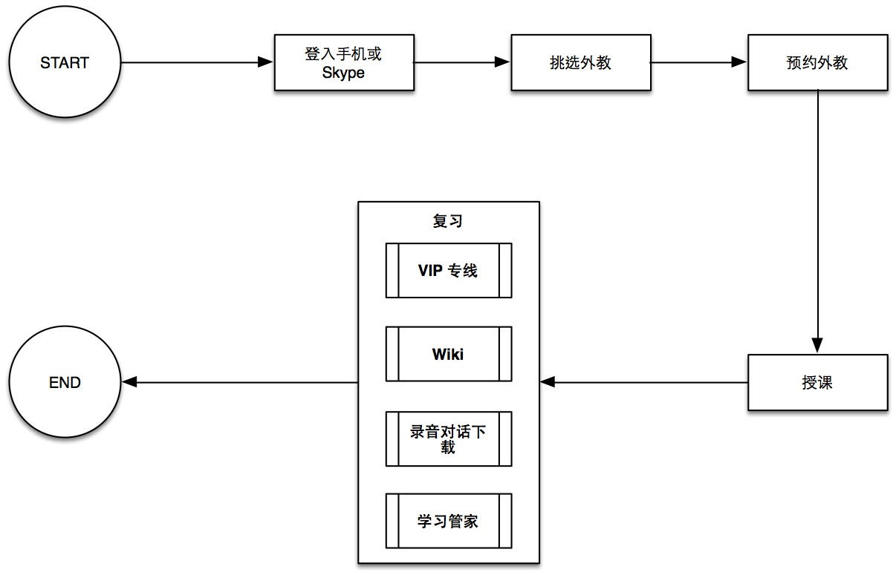

# 英语流利说竞品分析
## 英语培训业界状况大概状况
### 现有英语口语教学的主要授课方式
### 线上英语教学发展现况
## 谁是可能的竞争对手？
|                               | [EF iLab](http://center.ef.com.cn/course-learn) 	| [快酷英语](http://www.kuaikuenglish.com/fee/index.shtml) | [新东方外教电话口语教学](http://www.koolearn.com/kouyu/) 	| [SpeakingMax](http://www.speakingmax.cn/course/) | [翼点通](http://m.jxt189.com/ydt/) | [极智改口语](https://itunes.apple.com/cn/app/ji-zhi-gai-kou-yu-kou-yu-lian/id663321429?mt=8)   		| [爱卡微口语](http://www.icardenglish.com) | [英语口语精华](http://www.kouyujinghua.com/index.html) | [Viki智能外教](http://www.mobk.net/#tech) | [英语流利说](http://www.liulishuo.com) |
|-------------------------------|:-----------:|:---------:|:---------------------:|:-------------:|:-------:|:-----------------:|:-----------:|:-------------:|:------------:|:-----------:|
|使用设备						    |PC专用软件	|Skype    |电话/Skype			|PC专用软件/手机|App    |PC专用软件/App  	|App        |App          |App         |App        |
|目标用户							|高阶用户/白领|中高阶用户|中高阶用户				|高阶用户/白领  |中小学生|准备留学考试的学生	|中低阶用户	|中低阶用户	  |中低阶用户	   |中低阶用户   |
|是否可利用极琐碎时间练习口语？		|X			|X		  |V 					|V 			  |V 	  |V 				|V 			|V 			  |V 		   |V 		    |
|是否具有智能评分功能？				|X 			|X 		  |X					|V 			  |V 	  |V 				|V 			|V 			  |V 		   |V 			|
|是否具有人工评分功能？				|V 			|V 		  |V 					|X 			  |X 	  |V 			    |X 			|X 			  |X 		   |X 			|
|是否具有录音回放功能？				|N/A 		|V 		  |V(可下载录音档) 		|V 			  |V 	  |V 			    |V 			|V 			  |X 		   |V 			|
|是否具有分享录音功能？				|X 			|X 		  |V 					|X 			  |X 	  |X 			    |V 		    |X 			  |X 		   |V 			|
|是否具有 Peer review 功能？		|X 			|X 		  |X 					|X 			  |X 	  |X 				|V 			|X 			  |X 		   |X 			|
|同公司是否有其他产品支持整合？		|V 			|X 		  |V 					|X 			  |V 	  |V 				|X 			|X 			  |X 		   |X 			|
|是否提供证书？					|V          |X 		  |V 				    |X 			  |X 	  |X 				|X 			|X 			  |X 		   |X 			|

### 竞争者分析
以上述表格分析；**新东方**、**SpeakingMax** 以及**爱卡微口语**为**英语流利**说最大的竞争对手，以下分项解说  

### 新东方外教电话口语教学

asdas
as
d
asd

### SpeakingMax
### 爱卡微口语

## 英语流利说产品核心功能
## 英语流利说产品现有问题
## 如何改善
## 英语流利说营运与推广策略
## 总结