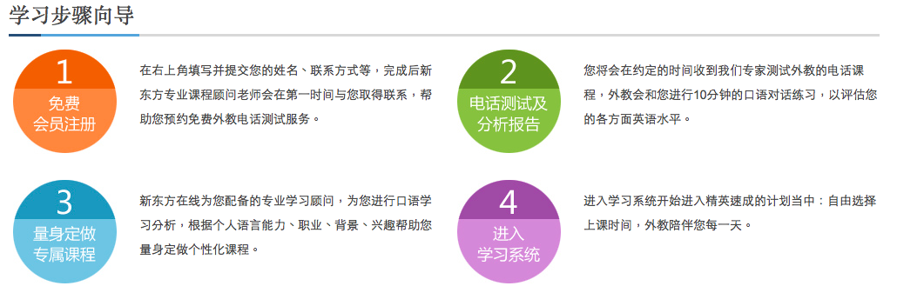
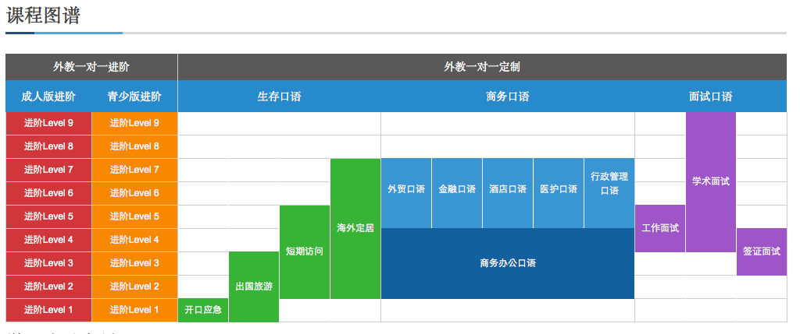
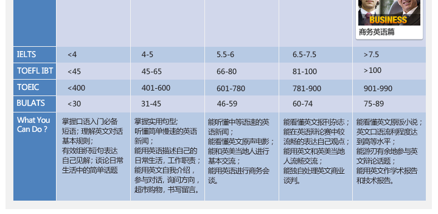
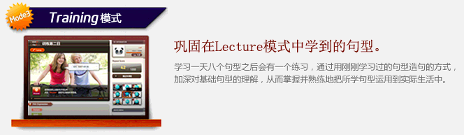
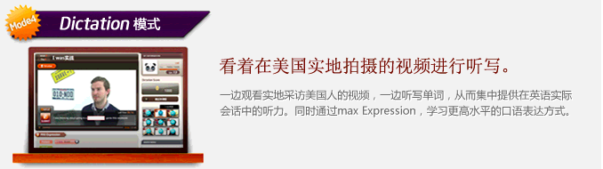
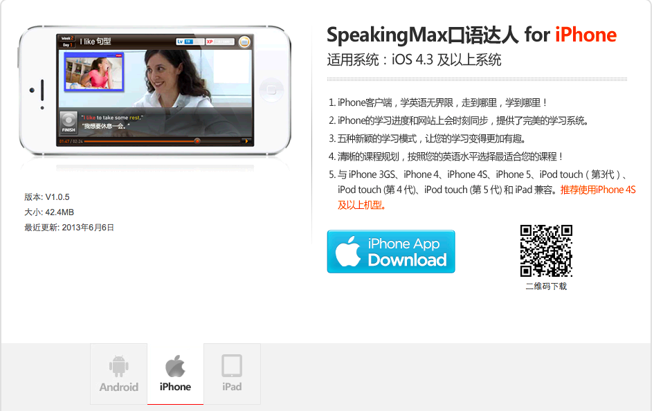
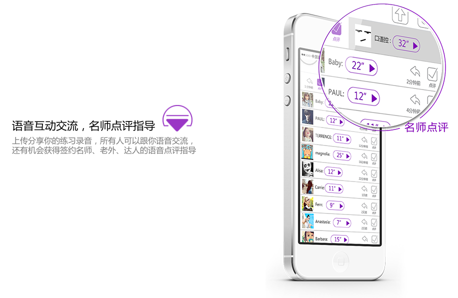
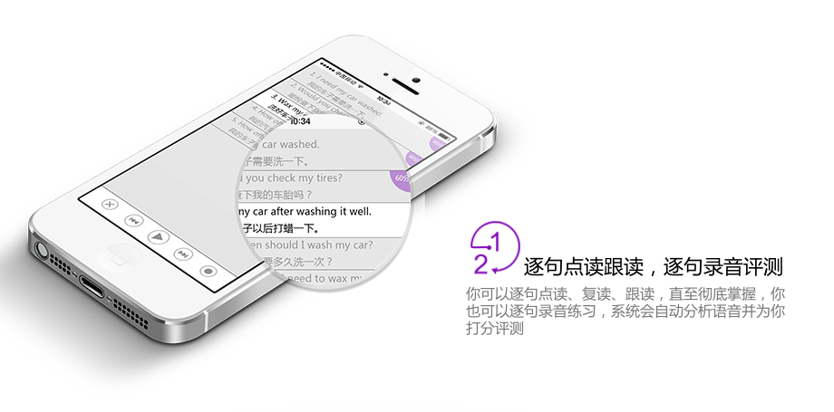
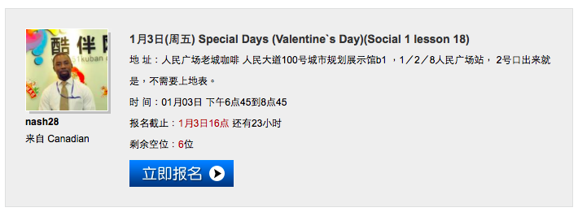

# 英语流利说竞品与产品分析

## 谁是可能的竞争对手？
|                               | [EF iLab](http://center.ef.com.cn/course-learn) 	| [快酷英语](http://www.kuaikuenglish.com/fee/index.shtml) | [新东方外教电话口语教学](http://www.koolearn.com/kouyu/) 	| [SpeakingMax](http://www.speakingmax.cn/course/) | [翼点通](http://m.jxt189.com/ydt/) | [极智改口语](https://itunes.apple.com/cn/app/ji-zhi-gai-kou-yu-kou-yu-lian/id663321429?mt=8)   		| [爱卡微口语](http://www.icardenglish.com) | [英语口语精华](http://www.kouyujinghua.com/index.html) | [Viki智能外教](http://www.mobk.net/#tech) | [英语流利说](http://www.liulishuo.com) |
|-------------------------------|:-----------:|:---------:|:---------------------:|:-------------:|:-------:|:-----------------:|:-----------:|:-------------:|:------------:|:-----------:|
|使用设备						    |PC专用软件	|Skype    |电话/Skype			|PC专用软件/手机|App    |PC专用软件/App  	|App        |App          |App         |App        |
|目标用户							|高阶用户/白领|中高阶用户|中高阶用户				|高阶用户/白领  |中小学生|准备留学考试的学生	|中低阶用户	|中低阶用户	  |中低阶用户	   |中低阶用户   |
|是否可利用极琐碎时间练习口语？		|X			|X		  |V 					|V 			  |V 	  |V 				|V 			|V 			  |V 		   |V 		    |
|是否具有智能评分功能？				|X 			|X 		  |X					|V 			  |V 	  |V 				|V 			|V 			  |V 		   |V 			|
|是否具有人工评分功能？				|V 			|V 		  |V 					|X 			  |X 	  |V 			    |X 			|X 			  |X 		   |X 			|
|是否具有录音回放功能？				|N/A 		|V 		  |V(可下载录音档) 		|V 			  |V 	  |V 			    |V 			|V 			  |X 		   |V 			|
|是否具有分享录音功能？				|X 			|X 		  |V 					|X 			  |X 	  |X 			    |V 		    |X 			  |X 		   |V 			|
|是否具有 Peer review 功能？		|X 			|X 		  |X 					|X 			  |X 	  |X 				|V 			|X 			  |X 		   |X 			|
|同公司是否有其他产品支持整合？		|V 			|X 		  |V 					|X 			  |V 	  |V 				|X 			|X 			  |X 		   |X 			|
|是否提供证书？					|V          |X 		  |V 				    |X 			  |X 	  |X 				|X 			|X 			  |X 		   |X 			|

### 竞争者分析
以上述表格分析；**新东方**、**SpeakingMax** 以及**爱卡微口语**为**英语流利**说的可能竞争对手，以下分项解说  

### 新东方外教电话口语教学

 
#### 目标客户
1. 收入较多或是可以负担中高学费的群众
2. 对科技产品如 PC 或智慧型手机操作不熟悉的群众		
3. 有证书需求
4. 只有零碎的时间可以利用的群众

#### 优劣分析

* 优势

	1. 新东方的整体产品线会对消费者的信赖度将有巨大的影响，同时此服务提供的口语认证将新东方的招牌利用到最大化，或许对某些具有迫切英语口语需求的求职者会有一定程度的吸引力。
	
	
	
	2. 同时，此产品对于使用者的 switching cost 相对低廉，利用手机便可授课，同时支援录音下载功能让学生可以自行审视自己的口语发音
	3. 新东方的专业教学经验以及平台会是一个非常大的产品支撑力
	4. 清楚的对话学习目标让客户选择难度  
	
	

* 劣势
	1. 虽然有录音回放功能但仍然没有一个办法让学生有可以重复播放的录音档模仿，缺乏利用智能音调匹配功能
	2. 虽然号称可以利用琐碎的时间上课但实际上仍然需要在上课时间中专心与教师对话，无法真正在某些场景如地铁、公车以及休息时间内联系口语
	3. 没有分享与 peer review 功能，学习必须要靠自身毅力维持

#### 总结
此产品虽然跟移动产品的客群有重复到，但客群比较针对有特别需求的客群，与流利说较为不同。同时此产品设计较为教学导向，与流利说的游戏导向也有所不同。但有可能在使用者进阶后便会跳去选择 EF iLab 或新东方课程。

### SpeakingMax

#### 目标客户
1. 收入较多可负担高学费的群众
2. 对科技产品如 PC 或智慧型手机操作熟悉的群众
3. 有完整时间可以利用的群众
4. 有琐碎时间可以利用的群众

#### 优劣分析

* 优势
	
	1. 产品线横跨 PC 以及手机客户端，客户不仅可以利用琐碎时间也允许完整的时间段学习
	2. 清楚的课程等级对照

	
	
	3. 游戏学习模式激励学员持续学习
	
	
	
	
	4. 完整的自学模式
		1. Repeat 模式
		
		
		
		2. Lecture 模式
		
		
		
		3. Training 模式
		
		
		
		4. Diction 模式
		
		
		
		5. Speech 模式
		
		
	
	5. 智能对比音频
	
	
	
	6. 多平台支持
	
	

* 劣势
	1. 与众多线上课程相比价格昂贵(一年约 4,0000 RMB)
	2. 没有其他产品线可以支持此产品，若客户对某一文法或用字有问题时只能自己找资料解决
	3. 需要网路连线才能收看节目，对移动客户端用户有一定的限制
	4. 丰富的资源只有在 PC 端才能使用，移动端功能受限

#### 总结
挟着丰富的教学模式，SpeakingMax 一开始便意图吸引高阶用户。虽然这些教学模式固然非常吸引人，但想完整利用还是必须坐在 PC 前面使用特定的软件才能使用。移动用户端使用者的功能受限。而且高昂的费用会让部分使用者却步

### 爱卡微口语

#### 目标客户
1. 收入较少或不想在口语课程花费较高费用的客群
2. 只有零碎时间可以利用的客群
3. 对智慧型手机操作较为熟悉的客群
	* 对社交软件使用较为活跃的使用者粘着度会更高

#### 优劣分析

* 优势
	1. 智能语音评分
	
	
	
	2. 社交分享功能
	3. Peer review
	
	
	
	4. 可录音与回放 
	
	
	
	5. 课程被切割成小部分，可充分利用琐碎时间

	> 爱卡微口语主打的是有规划的梯度式课程教学，想从音标、单词到句子、场景各部分来整体提升用户的对话能力。因此它将课程分为“每日一句”、“口语小词大用”、“时尚俚语”、“场景口语”、“美式发音基础”等 5 个分类，且充分体现了“微”的概念：每个分类每天只提供一句学习内容，第二日的内容等到第二日才可以解锁。

* 劣势
	1. 单一的练习模式，让学生容易感觉容易单调
	2. 课程解锁问题可能会让使用者认为进度太慢
	3. 自定义学习进度对于使用者而言也是一个考验
	4. 没有排行榜

#### 总结
此产品应是英语流利说最大的竞争对手，原因不外乎所有的功能几乎都跟流利说重叠但比流利说多出一个 peer review 以及社交功能。此模式根据 [36kr 关于爱卡微口语的报导](http://www.36kr.com/p/205572.html)对此产品商业模式的可能性也有所提升，节录如下：

> 上文提到的爱卡微口语的盈利探索，则体现在对上传后录音的“点评”上。袁鹏说，目前第一版本中的点评会由他们团队的老师随机点评，不一定能覆盖所有用户。而下一个或者第三个版本中，则考虑开放“签约老师”、“签约达人”、“签约老外”的申请通道，让觉得自己水平足够的用户自主申请签约资格。而若有用户希望自己的口语得到指导，就可以通过付费来邀请“签约”老师的点评。（付费版用户可以在应用内免费使用所有功能，而未来升级后的免费版本则会将此作为 Freemium 的收费点）

在每个课程页面下用户上传的录音都是公开的，让所有同学利用 peer review 功能打分。

> 由于每个课程页面下用户上传的录音全部是公开化的，因此可以形成一个大家基于课程交流的氛围。虽然我试用时还只有我一个人还没法自己跟自己玩，但袁鹏说未来用户数多了以后，会在用户上传录音时即给出一个智能打分的分数，并加入排行榜，通过置顶的方式呈现最优秀的学习者，激励并带动其他人的学习。

未来此产品可能会利用社交元素加强粘着度，最后商业模式发展的进程有可能是像[酷伴英语](http://www.51kuban.com/index/service)一样导入实体口说课程创造盈利

## 英语流利说产品核心功能
1. 智能打分
2. 课程涵盖范围广泛
	* 从基础到挑战共 4 个等级
	* 分类从日常英语到娱乐共 4 种类别  	
3. 详尽的个人进度与数据统计
4. 不同的排行榜满足使用者的竞争心
5. 游戏模式提高使用者粘着度
6. 语音回放功能
7. 多设备课程进度同步
8. 字典查询功能
9. 单词收藏功能
10. 整合讨论区提高使用者粘着度
11. 与微信深度整合

## 英语流利说产品现有问题
1. 单调的练习模式
	* 现有的移动端练习模式均只有单纯的发音矫正与口语练习
2. 社交元素还不够完善
3. 微信分享功能再加强
4. 除了商业英语，应可再加强学术英语如 TOFEL 以及 IELTS 的口语考试练习题目，此种学生的学习目标明显、学习意愿高。虽然大部分可能会是学生但仍有不少上班族在计划出国留学，此种需求仍不能被忽视
5. 盈利模式单一
	* 只有透过 IAP 的功能获得一定程度的收入

## 如何改善
1. 单调的练习模式
	* 参考 SpeakingMax 的教学模式并修改成适合移动客户端的模式以符合更多的移动用户场景以吸引客户
2. 社交元素与微信整合再加强
	* 目前已经与微信深度整合，可以让使用者分享有意思的课程，让被分享者可以直接在微信客户端上直接体验该课程。
	* 让使用者可以分享自己的个人首页，秀出自己持续学习或是傲人的成绩。可分享的平台应该包括
		1. 人人
		2. 微博
		3. 微信
		4. 易信等
3. 研究考试英语是否对流利说有力，需要分析现有使用者的
	1. 年纪
	2. 职业
	3. 使用意图
	4. 使用课程等
	
	才能判断考试口语课程是否值得加入流利说
4. 盈利模式加强
	* 可以学习爱卡微口语的 O2O 发展模式，目前流利说已经有一定程度的使用者；同时也有经营讨论区，此部分是完全可以参考爱卡微口语的 O2O 战略，但收费方式仍然需要研究，单纯的 C2C 业态可能存在营销风险，而 B2C 会让流利说在短期内负担较大的金额支出。

## 总结
线上英语学习发展至今已经有很多模式如

1. Skype 授课
2. 电话授课
3. 手机自行学习

虽然学习方式众多，但掌握提高学生学习效果的诀窍才是在此市场站稳脚步的不二法门。个人认为酷伴的 O2O 模式、SpeakingMax 的教学模式以及爱卡微口语的社交元素皆是流利说可以参考加强的地方。

同时仍然需注意旧时代(如新东方的电话教学)的教学方式，其客群仍然有可能与流利说重叠。

#

 英语流利说竞品与产品分析 by <a xmlns:cc="http://creativecommons.org/ns#" href="http://about.me/jyuny1" property="cc:attributionName" rel="cc:attributionURL">Liu, Jun Yi</a> is licensed under a <a rel="license" href="http://creativecommons.org/licenses/by-nc/4.0/">Creative Commons Attribution-NonCommercial 4.0 International License</a>.

